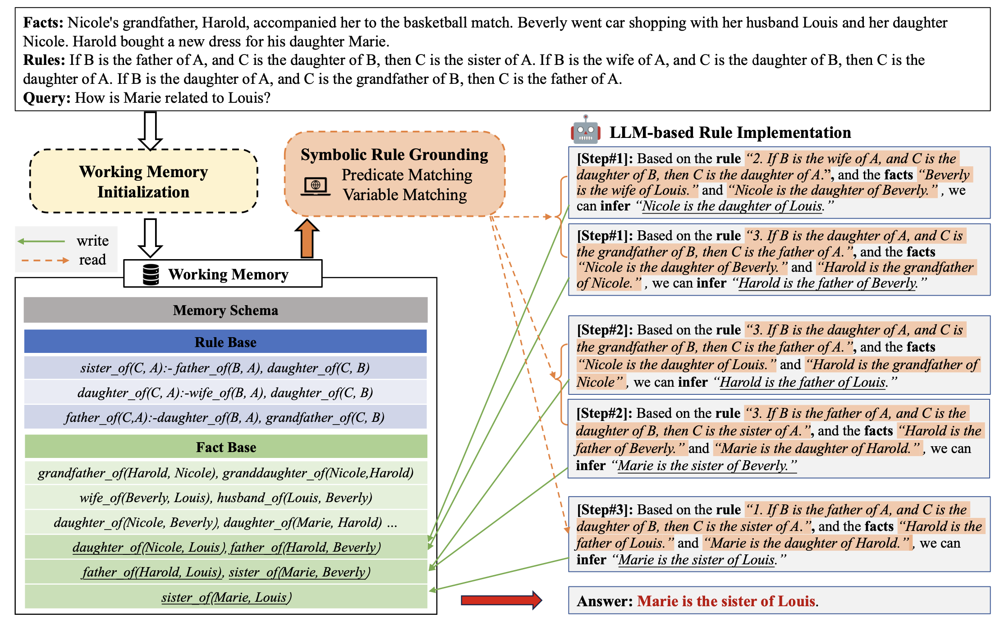

# Symbolic Working Memory Enhances Language Models for Complex Rule Application [[Paper]](https://arxiv.org/abs/2408.13654)

This repository hosts the codes and data of our Symbolic Working Memory Enhanced Rule Application Framework. 
